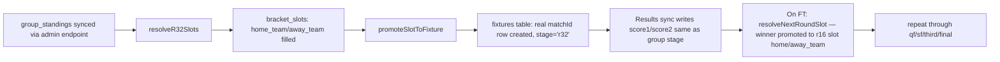

# Knockout Bracket + Stage-Weighted Scoring — Build Spec

> Scope: self-seeding knockout bracket (R32 → Final) from official `group_standings`,
> plus stage-multiplier scoring for all knockout rounds and a fixed absolute scale for the Final.
> MD spec only — no files touched in the repo. Apply these snippets yourself.

---

## 1. Scoring Rules (locked)

### 1.1 Base tiers (group stage + R32/R16/QF/SF/3rd, before multiplier)

The 3-tier "close wrong guess" path is **removed**. Base is now 3 outcomes only:

| Result | Base Pts |
|---|---|
| Exact correct score | 15 |
| Correct outcome + goal difference within 1 | 8 |
| Correct outcome only | 5 |
| Wrong outcome | 0 |

Knockout matches have **no draw** (extra time/penalties resolve it), so "correct outcome" in
knockout rounds means **picked the correct winner** — not W/D/L. Group stage keeps W/D/L.

### 1.2 Stage multipliers (applied to base tiers above)

| Stage | Multiplier | Resulting scores (Exact / Close / Outcome / Wrong) |
|---|---|---|
| Group | 1x | 15 / 8 / 5 / 0 |
| Round of 32 | 1.5x | 22.5 / 12 / 7.5 / 0 |
| Round of 16 | 2x | 30 / 16 / 10 / 0 |
| Quarterfinal | 2.5x | 37.5 / 20 / 12.5 / 0 |
| Semifinal | 3x | 45 / 24 / 15 / 0 |
| 3rd place match | 3x | 45 / 24 / 15 / 0 |
| **Final** | **fixed scale, not multiplied** | **50 / 40 / 30 / 0** |

Decimal points (22.5, 12.5, 37.5) are intentional and fine — `totalPoints` should be stored as a
numeric/float, not an integer. If you want whole numbers only, scale the whole base tier set ×2
(30/16/10/0 group baseline) so every multiplier output stays an integer — flag if you want this
instead, otherwise the spec below keeps decimals.

### 1.3 Final scoring — fixed absolute scale (no multiplier math)

The Final does not multiply the base tiers. It uses its own flat scale:

| Result | Pts |
|---|---|
| Exact correct score | 50 |
| Correct outcome + goal difference within 1 | 40 |
| Correct winner only | 30 |
| Wrong winner | 0 |

### 1.4 Unified scoring function (base version — see §1A.2 for the final signature)

This is the scoring core for matches that **never tie** on the predicted or actual scoreline.
§1A.2 below adds the `predWinner`/`actualWinner` parameters needed for knockout draws decided on
penalties — use the §1A.2 version as the real implementation; this version is here to establish
the base tier/multiplier logic before the penalty-winner complexity is layered on.

```js
// scoring.js — single source of truth, import this everywhere
// (scripts/app.js, src/leaderboard.js, src/main.js all currently have their
// own copy — see PATCH NOTES at bottom for where to delete the duplicates)

const STAGE_MULTIPLIERS = {
  group: 1,
  r32: 1.5,
  r16: 2,
  qf: 2.5,
  sf: 3,
  third: 3,       // 3rd place playoff, same weight as SF
  final: null,    // null = use FINAL_FIXED_SCALE instead of multiplying
};

const FINAL_FIXED_SCALE = { exact: 50, close: 40, outcome: 30, wrong: 0 };
const BASE_TIERS = { exact: 15, close: 8, outcome: 5, wrong: 0 };

const KNOCKOUT_STAGES = new Set(["r32", "r16", "qf", "sf", "third", "final"]);

/**
 * @param {number} p1 predicted score team1
 * @param {number} p2 predicted score team2
 * @param {number} a1 actual score team1
 * @param {number} a2 actual score team2
 * @param {string} stage one of: group | r32 | r16 | qf | sf | third | final
 * @returns {number} points awarded
 */
function scoreMatch(p1, p2, a1, a2, stage) {
  const isKnockout = KNOCKOUT_STAGES.has(stage);

  const predOutcome = Math.sign(p1 - p2);
  const actualOutcome = Math.sign(a1 - a2);

  const exact = p1 === a1 && p2 === a2;
  const correctOutcome = predOutcome === actualOutcome;
  const closeGD = Math.abs((p1 - p2) - (a1 - a2)) <= 1;

  if (stage === "final") {
    if (exact) return FINAL_FIXED_SCALE.exact;
    if (correctOutcome && closeGD) return FINAL_FIXED_SCALE.close;
    if (correctOutcome) return FINAL_FIXED_SCALE.outcome;
    return FINAL_FIXED_SCALE.wrong;
  }

  const multiplier = STAGE_MULTIPLIERS[stage] ?? 1;
  let base;
  if (exact) base = BASE_TIERS.exact;
  else if (correctOutcome && closeGD) base = BASE_TIERS.close;
  else if (correctOutcome) base = BASE_TIERS.outcome;
  else base = BASE_TIERS.wrong;

  return base * multiplier;
}
```

**This function is incomplete for knockout draws** — it will silently produce wrong answers if
`p1 === p2` or `a1 === a2` on a knockout fixture, because `Math.sign(0)` is `0`, which won't equal
either team's `±1` outcome sign, so a tied prediction or tied result on a knockout match falls
through to the "wrong" tier even when it should be scoreable via the penalty winner. **Do not ship
this version for knockout rounds** — §1A.2 replaces it with the version that handles this.

### 1.5 Patch notes — where the OLD scoring logic lives and must be replaced

You have **3 separate copies** of the old 15/8/5/3/0 (4-tier) scorer. All three need the same
fix: delete the "close wrong guess → 3pts" branch, add the `stage` param, multiply.

1. **`src/leaderboard.js`** — `scoreMatch_()` (top of file). Currently:
   ```js
   function scoreMatch_(p1, p2, a1, a2) {
     if (p1 === a1 && p2 === a2) return 15;
     const predOutcome = Math.sign(p1 - p2);
     const actualOutcome = Math.sign(a1 - a2);
     if (predOutcome === actualOutcome) {
       const diffGap = Math.abs(p1 - p2 - (a1 - a2));
       return diffGap <= 1 ? 8 : 5;
     }
     const totalGap = Math.abs(p1 - a1) + Math.abs(p2 - a2);
     return totalGap <= 2 ? 3 : 0;  // ← DELETE this 3pt branch
   }
   ```
   Replace with the `scoreMatch()` function from §1.4 (Apps Script is plain JS, paste directly,
   rename to `scoreMatch_` to match existing call sites, add a `stage` 5th argument).
   Every call site (`scoreMatch_(pred1, pred2, result.score1, result.score2)`) needs the stage
   value appended — pull `stage` from the `fixtures` row joined on `matchId` (see §3.2).

2. **`scripts/app.js`** — `calculateMatchPoints` (referenced in `src/leaderboard.js` comment
   "mirrors scripts/app.js calculateMatchPoints" — find and apply the same patch client-side
   for instant UI feedback before the server confirms).

3. **`src/main.js`** — `buildLeaderboard()` helper (older Firestore-direct version) has its own
   inline `scoreMatch()` with `15/8/5` tiers — same fix, same stage param.

**Action: consolidate into one file.** Recommend creating `src/scoring.js` (Apps Script side) and
`scripts/scoring.js` (frontend side, loaded as a plain `<script>` before `app.js`) with the
identical `scoreMatch()` body, and have all 3 call sites import/call that single function instead
of keeping local copies. This is also what `audit_results.md` flagged as P1 #3 (Multi-Source
Scoring Conflict) — this rewrite resolves that finding too.

---

## 1A. Knockout Draws — Penalty Winner Picker

Knockout matches can't end level. If the predicted score is a draw (`p1 === p2`), the user must
also declare who they think wins on penalties — there's no way to derive a winner from `3-2` vs
`2-2` automatically once the scores tie. Same applies to the **actual result**: if `score1 ===
score2` on a finished knockout fixture, you need a separately-recorded penalty winner, because
the live-score API will hand you the 90+ET scoreline, not a shootout result.

This means **two new fields**, one on predictions and one on fixtures/results — not derived,
stored directly:

```sql
-- supabase/migrations/20260622000200_add_penalty_winner_fields.sql

-- Predictions: only meaningful when pred1 === pred2 on a knockout fixture
alter table predictions add column if not exists pred_winner text; -- team name, null unless tied pick

-- Results: only meaningful when score1 === score2 on a knockout fixture
alter table fixtures add column if not exists penalty_winner text; -- team name, null unless tied result

comment on column predictions.pred_winner is
  'Set only when pred1 = pred2 on a knockout-stage fixture (group draws are valid, no winner needed). Team name matching fixtures.team1/team2.';
comment on column fixtures.penalty_winner is
  'Set only when score1 = score2 on a knockout-stage fixture (regular+ET draw resolved by penalties). Null for group stage and any knockout match decided in 90/120 mins.';
```

> Note: `fixtures.penalty_winner` is the same column flagged in §3.3 below for bracket
> advancement — it's not a duplicate, this is the single column serving both purposes (which team
> advances, and what the live-score sync writes once the shootout result comes in).

### 1A.1 Frontend — the popup trigger

The popup fires at the moment the user enters equal numbers in both score inputs for a knockout
fixture — not on save, immediately on input, so they can't get partway through submitting without
seeing it:

```js
// scripts/app.js — inside the score-input change handler (wherever pred1/pred2 inputs are bound)
function onScoreInputChange(matchId, side, value) {
  const fixture = STATE.fixtures[matchId];
  const isKnockout = KNOCKOUT_STAGES.has(fixture.stage); // reuse set from scoring.js
  const draft = STATE.predictionDrafts[matchId] || { pred1: null, pred2: null, predWinner: null };
  draft[side] = Number(value);
  STATE.predictionDrafts[matchId] = draft;

  if (isKnockout && draft.pred1 !== null && draft.pred2 !== null && draft.pred1 === draft.pred2) {
    openPenaltyWinnerPopup(matchId, fixture.team1, fixture.team2);
  } else {
    draft.predWinner = null; // clear stale winner pick if score is no longer tied
  }
}

function openPenaltyWinnerPopup(matchId, team1, team2) {
  // Render a small modal/inline chooser with two flag buttons, no third option —
  // this is a forced choice, not skippable, per the "required if x-x" rule.
  showModal("penalty-winner-modal", {
    title: "Who wins on penalties?",
    options: [
      { label: team1, flag: getTeamFlag(team1), onClick: () => setPredWinner(matchId, team1) },
      { label: team2, flag: getTeamFlag(team2), onClick: () => setPredWinner(matchId, team2) },
    ],
  });
}

function setPredWinner(matchId, teamName) {
  STATE.predictionDrafts[matchId].predWinner = teamName;
  closeModal("penalty-winner-modal");
  // Now safe to enable the save/submit control for this card.
}
```

**Save button gating**: the existing `savePrediction(matchId)` function needs a guard at the top —
block the write (and ideally disable the button in the UI, not just reject on click) whenever the
fixture is knockout, the scores are tied, and `predWinner` is still null:

```js
function savePrediction(matchId) {
  const fixture = STATE.fixtures[matchId];
  const draft = STATE.predictionDrafts[matchId];
  const isKnockout = KNOCKOUT_STAGES.has(fixture.stage);
  const isTied = draft.pred1 === draft.pred2;

  if (isKnockout && isTied && !draft.predWinner) {
    showToast("Pick a penalty winner before saving", "error");
    return; // do not write to predictions table
  }
  // ...existing save logic, now also writing draft.predWinner into pred_winner column
}
```

Group-stage draws are unaffected — `isKnockout` gates this entirely, a `1-1` group prediction
saves exactly as it does today, no popup, no `pred_winner` written (stays `null`).

### 1A.2 Scoring — `pred_winner` / `penalty_winner` feed into `scoreMatch()`

§1.4's `scoreMatch()` needs two more parameters and a branch: when both predicted and actual
scores are tied, "exact" requires the winners to match too, not just the scoreline.

```js
// scoring.js — revised signature, replaces the §1.4 version
// predWinner/actualWinner use "team1"/"team2" slot labels (not team name
// strings) so this function never needs to know actual team names — keeps
// it pure and matches how fixtures.team1/team2 are already addressed
// elsewhere in the codebase (see getTeamFlag(fixture.team1) calls).
function scoreMatch(p1, p2, a1, a2, stage, predWinner, actualWinner) {
  const isKnockout = KNOCKOUT_STAGES.has(stage);
  const predTied = p1 === p2;
  const actualTied = a1 === a2;

  const scoreMatches = p1 === a1 && p2 === a2;
  // Exact requires the scoreline to match AND, if it was a tied scoreline on a
  // knockout fixture, the picked winner must match the actual shootout winner.
  const exact = isKnockout && predTied && actualTied
    ? scoreMatches && predWinner === actualWinner
    : scoreMatches;

  // Outcome comparison: for knockout, resolve to "team1"/"team2" either from
  // the scoreline directly, or from the declared penalty winner when tied.
  const predOutcomeTeam = predTied ? predWinner : (p1 > p2 ? "team1" : "team2");
  const actualOutcomeTeam = actualTied ? actualWinner : (a1 > a2 ? "team1" : "team2");

  const correctOutcome = isKnockout
    ? predOutcomeTeam === actualOutcomeTeam
    : Math.sign(p1 - p2) === Math.sign(a1 - a2); // group stage: W/D/L via sign, draws are a valid outcome

  const closeGD = Math.abs((p1 - p2) - (a1 - a2)) <= 1;

  if (stage === "final") {
    if (exact) return FINAL_FIXED_SCALE.exact;
    if (correctOutcome && closeGD) return FINAL_FIXED_SCALE.close;
    if (correctOutcome) return FINAL_FIXED_SCALE.outcome;
    return FINAL_FIXED_SCALE.wrong;
  }

  const multiplier = STAGE_MULTIPLIERS[stage] ?? 1;
  let base;
  if (exact) base = BASE_TIERS.exact;
  else if (correctOutcome && closeGD) base = BASE_TIERS.close;
  else if (correctOutcome) base = BASE_TIERS.outcome;
  else base = BASE_TIERS.wrong;

  return base * multiplier;
}
```

Since `predWinner`/`actualWinner` are slot labels, **the DB columns need to store the same
convention** — `predictions.pred_winner` and `fixtures.penalty_winner` should both store
`"team1"` or `"team2"` (matching the fixture's own `team1`/`team2` fields), not the literal team
name string. Revise the migration comment in §1A accordingly:

```sql
-- Correction to §1A migration comments: store slot label, not team name
comment on column predictions.pred_winner is
  'team1 or team2 — which side wins on penalties. Set only when pred1 = pred2 on a knockout fixture.';
comment on column fixtures.penalty_winner is
  'team1 or team2 — which side won on penalties. Set only when score1 = score2 on a knockout fixture (FT).';
```

This also simplifies §1A.1's popup handler — `setPredWinner` should store `"team1"`/`"team2"`,
not the team name:

```js
function openPenaltyWinnerPopup(matchId, team1, team2) {
  showModal("penalty-winner-modal", {
    title: "Who wins on penalties?",
    options: [
      { label: team1, flag: getTeamFlag(team1), onClick: () => setPredWinner(matchId, "team1") },
      { label: team2, flag: getTeamFlag(team2), onClick: () => setPredWinner(matchId, "team2") },
    ],
  });
}
```

Call sites (§1.5 / §4) now pass two more args:
```js
scoreMatch_(pred1, pred2, result.score1, result.score2, fixture.stage,
            prediction.pred_winner, fixture.penalty_winner);
```

For non-tied predictions/results `pred_winner`/`penalty_winner` are simply `null` and never read
(the `predTied`/`actualTied` guards skip straight past them), so this is safe to pass
unconditionally on every call without branching at the call site.

### 1A.3 Result-entry side — where does `fixtures.penalty_winner` get set?

Your live-score sync (`syncScores` / `fetchAndUpdateLiveScores`) currently only writes
`score1`/`score2`/`status`. The upstream API (`worldcup26.ir` or whichever live source is wired
per `ARCHITECTURE.md`) needs to expose a penalty-shootout result field for knockout matches —
check what field name it actually returns (commonly `penalty_home`/`penalty_away` or a
`winner_after_penalties` style field) before assuming the shape below; this is a placeholder until
you've confirmed the real API response for a knockout match that goes to penalties:

```js
// Inside the existing results-sync function, after writing score1/score2/status:
if (status === "FT" && score1 === score2 && KNOCKOUT_STAGES.has(fixture.stage)) {
  const penaltyWinner = extractPenaltyWinnerFromApiPayload(item); // confirm real field name
  await updateFixture(env, fixture.matchId, { penalty_winner: penaltyWinner });
}
```

If the live API doesn't expose this at all (plausible — some free-tier feeds skip shootout detail),
you'll need a manual admin override input for it, similar to the manual SQL inserts already
mentioned in your recent work for missing match results. Worth confirming the API behavior on the
first knockout match that actually goes to penalties before relying on it being automatic.

---

## 2. Data Model Additions

### 2.1 `fixtures` table — add `stage` enum values for knockout

You already have `stage: text` on `fixtures` (per `ARCHITECTURE.md` schema: `"group"` or
`"knockout"` today). **Expand this** to carry the specific knockout round, since the multiplier
needs to know which one:

```sql
-- supabase/migrations/20260622000000_knockout_stage_values.sql
-- Widen stage semantics: previously only 'group' | 'knockout'.
-- Now: 'group' | 'r32' | 'r16' | 'qf' | 'sf' | 'third' | 'final'

alter table fixtures
  add column if not exists round_label text; -- human label, e.g. "Round of 16", "Final"

comment on column fixtures.stage is
  'group | r32 | r16 | qf | sf | third | final — drives scoring multiplier and bracket placement';

-- backfill existing knockout rows is a manual one-time pass once R32 fixtures
-- are generated (see §3) — there is nothing to backfill yet since knockout
-- fixtures don't exist in the table until the bracket-seeding job runs.
```

### 2.2 New table: `bracket_slots`

Knockout fixtures don't exist as fully-formed `fixtures` rows until group stage finishes —
you need a placeholder structure that tracks "Winner of Group A vs Runner-up Group B" style
slots, then resolves them into real `fixtures` rows (with real team names) once standings lock.

```sql
-- supabase/migrations/20260622000100_create_bracket_slots.sql
create table if not exists bracket_slots (
    id bigint generated always as identity primary key,

    stage text not null check (stage in ('r32','r16','qf','sf','third','final')),
    slot_index integer not null,        -- position within the stage, 1-indexed
                                          -- (r32 has 16 slots/matches, r16 has 8, etc.)

    -- Source definition: where do the two teams in this match come from?
    -- For R32, sources are group positions. For later rounds, sources are
    -- "winner of bracket_slots.id X" / "loser of X" (loser only used for 3rd place).
    home_source_type text not null check (home_source_type in ('group_position','match_winner','match_loser')),
    home_source_ref text not null,      -- e.g. 'A1' (group A, 1st place) or 'r32-3' (winner of r32 slot 3)
    away_source_type text not null check (away_source_type in ('group_position','match_winner','match_loser')),
    away_source_ref text not null,

    -- Resolved once both source teams are known (after standings sync / earlier round result)
    home_team text,
    away_team text,
    fixture_match_id text references fixtures("matchId"),  -- linked once promoted to a real fixture row

    resolved_at timestamptz,
    created_at timestamptz default now()
);

create unique index if not exists idx_bracket_stage_slot
on bracket_slots(stage, slot_index);
```

The `home_source_ref` / `away_source_ref` values for **R32** follow the standard FIFA 48-team
bracket draw pattern (e.g. `1A` = Group A winner, `2B` = Group B runner-up, `3C/3D/3E/3F` referring
to ranked-3rd-place qualifiers depending on the actual 2026 draw sheet you're using). **You need
to hardcode the actual R32 pairing sheet here** — FIFA's official format for 48 teams pairs group
winners/runners-up with specific third-place slots that aren't fixed until group stage completes
(third-place ranking depends on points across all groups). This table structure supports it once
you have the official pairing sheet; the seeding job in §3 reads these refs.

> **Open item for you to fill in** — the spec assumes you'll paste in the official 2026 Round of 32
> draw sheet (which exact `2A` vs `2C`-or-`3rd-place` pairings) once FIFA publishes/confirms it. If
> you already have this from `worldcup26.ir`, fetch it once and hardcode the 16 `bracket_slots` rows
> for R32 directly — don't try to derive the pairing algorithmically, it's not a simple formula for
> 48 teams (it depends on which specific groups the 8 third-place qualifiers come from).

---

## 3. Bracket Self-Seeding Logic

### 3.1 High-level flow



### 3.2 Worker endpoint additions (`workers/live-results.js`)

```js
// New endpoint: POST /admin/seed-bracket
// Call this once group stage is final (or re-call any time standings update
// pre-finish — it's idempotent, only fills slots that aren't resolved yet).

async function seedBracketR32(env) {
  const standings = await getGroupStandings(env); // existing group_standings read

  // Build a lookup: "A1" -> team_name, "B2" -> team_name, etc.
  const positionLookup = {};
  for (const row of standings) {
    positionLookup[`${row.group_name}${row.position}`] = row.team_name;
  }

  const slots = await getBracketSlots(env, "r32"); // the 16 hardcoded slot rows from §2.2

  for (const slot of slots) {
    const homeTeam = resolveSourceRef(slot.home_source_ref, positionLookup, standings);
    const awayTeam = resolveSourceRef(slot.away_source_ref, positionLookup, standings);

    if (!homeTeam || !awayTeam) continue; // 3rd-place ranking not final yet, skip

    await updateBracketSlot(env, slot.id, { home_team: homeTeam, away_team: awayTeam });
    await promoteSlotToFixture(env, slot, homeTeam, awayTeam); // creates/updates fixtures row
  }

  return { seeded: slots.filter(s => s.home_team).length, total: slots.length };
}

// "1A" -> direct group position. "3rdRanked-1" -> needs cross-group 3rd-place
// ranking (points, then GD, then goals scored, per FIFA tiebreak rules) —
// implement this ranking once you have the official R32 pairing sheet from §2.2.
function resolveSourceRef(ref, positionLookup, standings) {
  if (/^[A-L][1-4]$/.test(ref)) return positionLookup[ref] || null; // e.g. "A1", "L2"
  // ranked-3rd-place refs handled separately — see open item in §2.2
  return null;
}

async function promoteSlotToFixture(env, slot, homeTeam, awayTeam) {
  const matchId = `bracket_${slot.stage}_${slot.slot_index}`;
  await upsertFixture(env, {
    matchId,
    team1: homeTeam,
    team2: awayTeam,
    stage: slot.stage,
    round: stageLabel(slot.stage), // "Round of 32" etc, for display
    group: null,
  });
  await linkSlotToFixture(env, slot.id, matchId);
}
```

### 3.3 Round-over-round promotion (R32 winner → R16 slot, etc.)

This runs inside your existing **5-minute cron** (`sync-scores`), right after results are
written, not as a separate trigger:

```js
// Inside the existing sync-scores cron handler, after results upsert:
async function promoteKnockoutWinners(env) {
  const finishedKnockoutMatches = await getFixtures(env, {
    stage_in: ["r32", "r16", "qf", "sf"], // sf winners feed final, not third
    status: "FT",
    promoted: false, // add a boolean flag column to fixtures to avoid re-promoting
  });

  for (const match of finishedKnockoutMatches) {
    const winner = match.score1 > match.score2 ? match.team1
                  : match.score2 > match.score1 ? match.team2
                  : await getPenaltyWinner(env, match.matchId); // penalty shootout result, separate field
    const loser = winner === match.team1 ? match.team2 : match.team1;

    // Find any bracket_slots row whose home/away_source_ref points to this match's winner/loser
    const dependentSlots = await getBracketSlotsBySourceMatch(env, match.matchId);
    for (const slot of dependentSlots) {
      const teamToFill = slot.home_source_type === "match_winner" && slot.home_source_ref === match.matchId
        ? winner
        : slot.away_source_type === "match_winner" && slot.away_source_ref === match.matchId
        ? winner
        : loser; // 'match_loser' source type — only used for the 3rd-place playoff slot

      await fillBracketSlotSide(env, slot.id, teamToFill, match.matchId);
    }

    await markFixturePromoted(env, match.matchId);
  }
}
```

**SF → Final/3rd special case**: each semifinal's *winner* feeds the Final, and its *loser* feeds
the 3rd-place match. Both `bracket_slots` rows (one `final`, one `third`) should reference the same
SF match's `matchId` — one as `match_winner`, one as `match_loser`.

**Penalty shootouts**: bracket advancement for a drawn knockout match uses `fixtures.penalty_winner`
(added in §1A.1 — same column the result-sync writes per §1A.3, and the same value that now
directly affects scoring per §1A.2, not just bracket progression). Don't add a second column for
this; one `penalty_winner` field serves both.

### 3.4 Frontend — bracket auto-populate (`scripts/app.js` → `renderBracket()`)

Replace the current stub. The bracket view should read straight from `fixtures` filtered by
knockout `stage`, same data source as everything else — no separate bracket-specific fetch:

```js
function renderBracket() {
  const stages = ["r32", "r16", "qf", "sf", "third", "final"];
  const byStage = {};
  stages.forEach(s => byStage[s] = []);

  Object.values(STATE.fixtures).forEach(fixture => {
    if (stages.includes(fixture.stage)) byStage[fixture.stage].push(fixture);
  });

  const bracketEl = document.getElementById("bracket");
  bracketEl.innerHTML = stages.map(stage => renderBracketRound(stage, byStage[stage])).join("");

  // Champion banner: only the 'final' fixture, only when it has a result
  const final = byStage.final[0];
  if (final && final.status === "FT") {
    const champion = final.score1 > final.score2 ? final.team1 : final.team2;
    document.querySelector(".champion-name").textContent = champion;
  }
}

function renderBracketRound(stage, fixtures) {
  if (!fixtures.length) {
    // Slots not seeded yet — show placeholder "TBD" cards matching slot count
    return renderEmptyBracketRound(stage);
  }
  return `
    <div class="bracket-round bracket-round-${stageOrder(stage)}">
      <h3>${stageLabel(stage)}</h3>
      <div class="bracket-stack">
        ${fixtures.map(renderBracketMatch).join("")}
      </div>
    </div>`;
}

function renderBracketMatch(fixture) {
  const myPred = STATE.predictions[fixture.matchId];
  const result = STATE.results[fixture.matchId];
  return `
    <div class="bracket-match" data-match-id="${fixture.matchId}" onclick="openMatchDrawer('${fixture.matchId}')">
      <div class="bracket-seed">${getTeamFlag(fixture.team1)} ${escapeHtml(fixture.team1)}</div>
      <strong>${result ? `${result.score1}-${result.score2}` : "vs"}</strong>
      <div class="bracket-seed">${getTeamFlag(fixture.team2)} ${escapeHtml(fixture.team2)}</div>
    </div>`;
}
```

The existing CSS (`.bracket-round-2` through `.bracket-round-6` padding offsets in `style.css`)
already assumes 5-6 columns — confirm `stageOrder()` maps `r32→1, r16→2, qf→3, sf→4, third→5,
final→6` (3rd place sits visually parallel to the final, not inline in the main bracket flow —
check the CSS `.bracket-round-5`/`.bracket-round-6` padding values match this, you may want 3rd
place in its own side-container outside `.vertical-bracket` rather than column 5 inline).

---

## 4. Scoring Integration — `submitPrediction` lock + stage lookup

Currently `submitPrediction` only needs `kickoffUTC` for the lock check. Once knockout fixtures
exist, scoring needs the fixture's `stage` value at calculation time, which you already have
since `fixtures.stage` is part of the row. No new endpoint needed — just make sure every place
that calls `scoreMatch_`/`scoreMatch` passes `fixture.stage` instead of assuming `"group"`:

```js
// src/leaderboard.js — buildLeaderboardSnapshot_(), inside the predictionRows.forEach loop
const fixture = fixturesById[matchId]; // build this lookup map once before the loop
const points = scoreMatch_(pred1, pred2, result.score1, result.score2, fixture.stage);
```

This is the one required call-site change beyond the function body patch in §1.5 — easy to miss
since the old 4-arg signature will silently run with `stage === undefined`, falling through to
`?? 1` multiplier (group rate) for every knockout match. **Test this specifically** after patching:
predict a R16 match, force a fake FT result, confirm leaderboard shows `30/16/10/0` not `15/8/5/0`.

---

## 5. Rules Modal Copy Update

`index.html` rules modal (`#rules-modal`) currently advertises the old 15/8/5/3/0 tiers including
the cutoff-date footnote about pre-June-18 matches keeping 3pts. Update:

- Remove the 3pt "Bonus" card and the cutoff footnote entirely (the 3-tier close-wrong-guess
  rule is gone, not grandfathered).
- Add a new section: "Knockout matches are worth more." Simple table: Group 1x, R32 1.5x,
  R16 2x, QF 2.5x, SF/3rd 3x, Final fixed 50/40/30/0.

---

## 6. Suggested Build Order

1. **`scoring.js` consolidation** (§1.4–1.5, §1A.2) — do this first, independent of bracket work,
   fixes the existing P1 audit finding either way. Build the §1A.2 version directly — don't ship
   the §1.4 version even temporarily, it silently mis-scores any knockout draw.
2. **`pred_winner` / `penalty_winner` columns + popup** (§1A) — also independent of bracket
   seeding, can ship before R32 fixtures even exist (the popup just won't have anything to fire on
   until knockout fixtures appear, but the DB columns, modal, and save-guard can all be built and
   tested against a manually-inserted fake knockout fixture row).
3. **`bracket_slots` migration + R32 hardcoded pairing sheet** (§2.2) — blocked on you having
   the actual FIFA draw sheet; everything else can be stubbed/tested with fake data meanwhile.
4. **`seedBracketR32` + cron promotion** (§3.2–3.3) in the Worker.
5. **`renderBracket()` rewrite** (§3.4) — can be built/tested against manually-inserted fake
   `bracket_slots`/`fixtures` rows before step 4 is wired to real standings.
6. **Rules modal copy** (§5) — quick, do whenever, no dependencies.

Re-run `$audit` after step 1 alone — it should resolve P1 finding #3 (Multi-Source Scoring
Conflict) on its own before you touch anything bracket-related.
