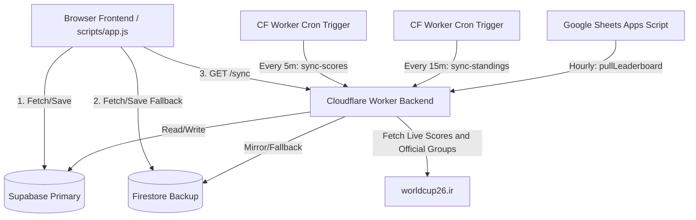

<Note>Last updated: 2026-06-24 (source: `ARCHITECTURE.md`)</Note>

## System overview

## Core components

<CardGroup cols={1}>
  <Card title="Browser frontend" icon="window">
    `index.html` + `scripts/app.js`. Fetches and saves prediction entries directly via Supabase
    (primary) and Firestore (mirror/fallback). Connects to the Cloudflare Worker to fetch compiled
    tournament payloads (`/sync`) and leaderboard data. For local or legacy deployments, also falls
    back to Apps Script-style query actions such as `?action=sync`, `?action=fixtures`, and
    `?action=leaderboard`.
  </Card>
  <Card title="Cloudflare Worker backend" icon="cloud">
    `workers/live-results.js` — primary API backend.
    - Exposes `/sync`, `/sync-scores`, `/admin/sync-standings`, `/fixtures`, `/leaderboard`
    - Runs every 5 minutes via Cron Triggers to fetch live scores, update results, and recalculate the leaderboard
    - Runs every 15 minutes to fetch official group tables from `worldcup26.ir/get/groups` and upsert `group_standings`
    - Implements the leaderboard ranking engine
  </Card>
  <Card title="Google Apps Script" icon="google">
    `src/main.js` — run-time client backup. Runs once an hour via a time-driven trigger to fetch
    the current leaderboard from the Cloudflare Worker (`GET /sync`) and populate the Google Sheet
    cells visually.
  </Card>
</CardGroup>

## Data load priority (browser)

Each data type has a resilient fallback hierarchy. Worker route URLs are tried first; matching
Apps Script query-action URLs are tried before the browser falls back to direct stores.

| Data | Tier 1 (Primary) | Tier 2 (Backup) | Tier 3 (Fallback) |
| :--- | :--- | :--- | :--- |
| **All game data** | `/sync` (Cloudflare Worker) | Direct Supabase fetch | Firestore / Local JSON |
| **Fixtures** | `/fixtures` (Cloudflare Worker) | Supabase `fixtures` | `2026/worldcup.json` |
| **Results** | `/sync` (Cloudflare Worker) | Supabase `results` | Firestore `results` |
| **Group standings** | `/sync` (Cloudflare Worker) | Supabase `group_standings` | Empty official table state |
| **Predictions** | Supabase `predictions` | Firestore `predictions` | localStorage |
| **Leaderboard** | `/leaderboard` (Cloudflare Worker) | Supabase `leaderboard` | `buildLocalLeaderboard()` |

## Database schemas (canonical)

### `fixtures`

| Field | Type | Notes |
| :--- | :--- | :--- |
| `matchId` | string | primary key, sequential e.g. `"1"`, `"72"` |
| `round` | string | |
| `group` | string | |
| `stage` | string | `"group"` or `"knockout"` |
| `date` | string | `YYYY-MM-DD` |
| `time` | string | |
| `kickoffUTC` | timestamptz | |
| `team1` / `team2` | string | |
| `ground` | string | |
| `apiFixtureId` | int (nullable) | maps `worldcup26.ir` `game.id` to this row; required for reliable score sync |

<Warning>
**Score sync mapping:** live API `game.id` → `fixtures.apiFixtureId` → `fixtures.matchId` →
`results.matchId`. Predictions always use `fixtures.matchId`. See `scripts/repair-matchids.js` if
rows drift.
</Warning>

### `predictions`

| Field | Type | Notes |
| :--- | :--- | :--- |
| `id` | string | primary key, `${username}_${matchId}` |
| `username` | string | |
| `matchId` | string | |
| `pred1` / `pred2` | int | |
| `submittedAt` | timestamptz | |
| `pointsAwarded` | int (nullable) | |
| `scoredAt` | timestamptz (nullable) | |

### `results`

| Field | Type |
| :--- | :--- |
| `matchId` | string (primary key) |
| `score1` / `score2` | int |
| `status` | `"FT"`, `"HT"`, `"LIVE"`, `"NS"` |
| `lastUpdated` | timestamptz |

### `users`

| Field | Type |
| :--- | :--- |
| `username` | string (primary key) |
| `displayName` | string |
| `secretCode` | string |
| `isAdmin` | boolean |
| `totalPoints` | int |
| `joinedAt` | timestamptz |

### `leaderboard`

| Field | Type |
| :--- | :--- |
| `username` | string (primary key) |
| `rank` | int |
| `displayName` | string |
| `totalPoints` | int |
| `exactScores` | int |
| `correctOutcomes` | int |
| `predicted` | int |
| `scored` | int |
| `updatedAt` | timestamptz |

### `group_standings`

| Field | Type |
| :--- | :--- |
| `id` | bigint identity (primary key) |
| `group_name` | text |
| `team_id` | text |
| `team_name` | text |
| `position` | int (1–4) |
| `played`, `won`, `drawn`, `lost` | int |
| `goals_for`, `goals_against`, `goal_difference` | int |
| `points` | int |
| `updated_at` | timestamptz |

Official group standings are synced from `worldcup26.ir/get/groups`; the frontend only renders
rows from this table and does not calculate ranks, points, or goal difference.

### `accountRequests`

| Field | Type |
| :--- | :--- |
| `username` | string (primary key) |
| `displayName` | string |
| `note` | string |
| `status` | `"pending"`, `"approved"`, `"rejected"` |
| `secretCode` | string |
| `createdAt` | timestamptz |
| `approvedAt` / `rejectedAt` | timestamptz (nullable) |

## Deployments

- **Frontend** — hosted statically (Firebase Hosting, GitHub Pages, or any static server)
- **Worker API** — deployed to Cloudflare using `npx wrangler deploy`
- **Sheets sync** — pushed to Google Apps Script using `clasp push` on target project ID `1Lx-q30o3CFcM7_h6OiuoiPNgRzaZE2SK_WnKkPFoBplS8W4ckWWa0B_0`
